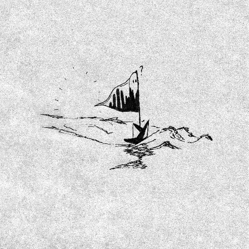
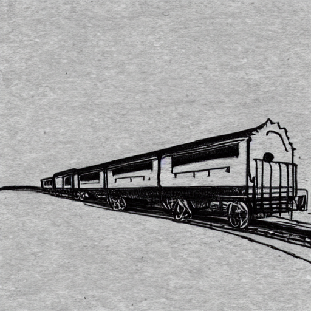
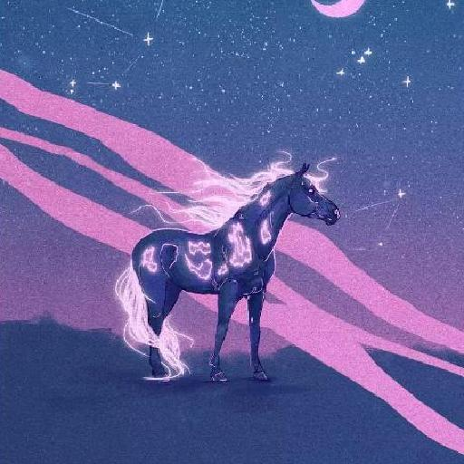
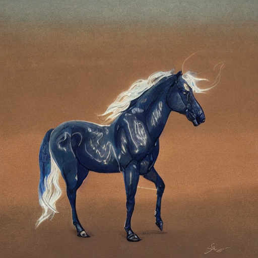
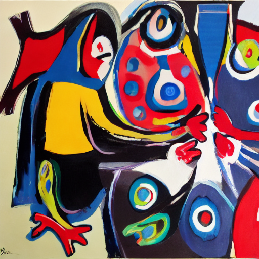
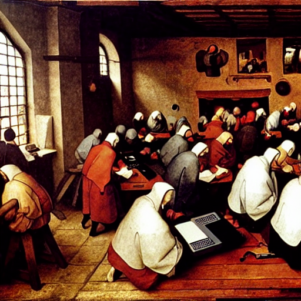
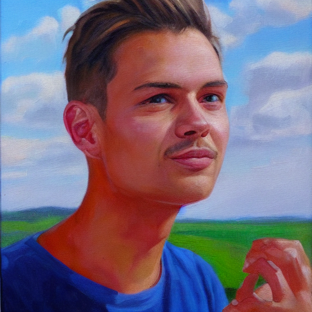
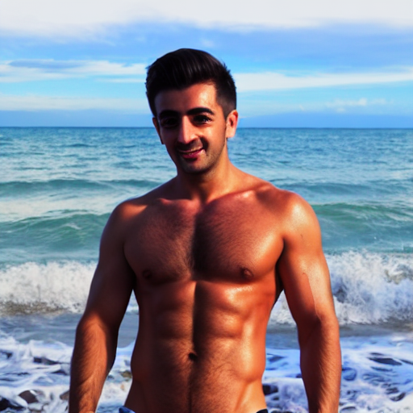
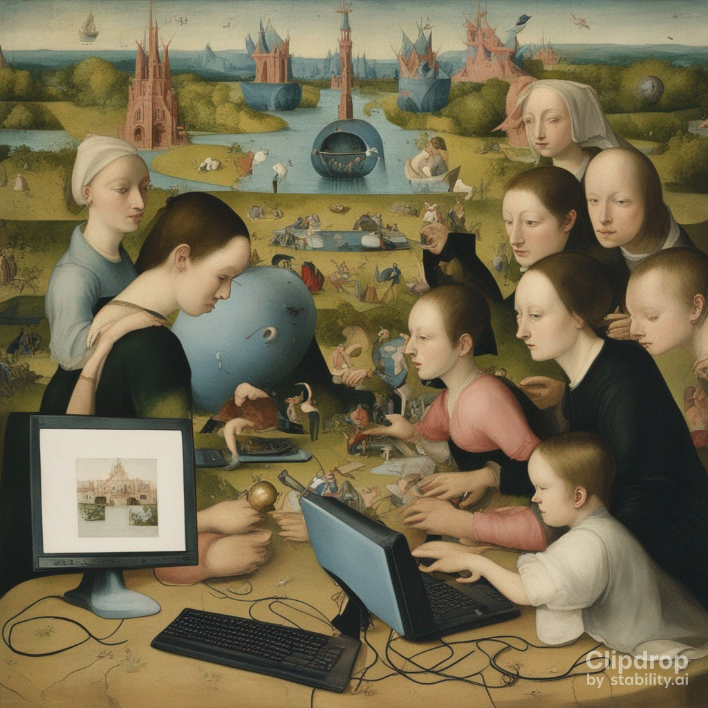
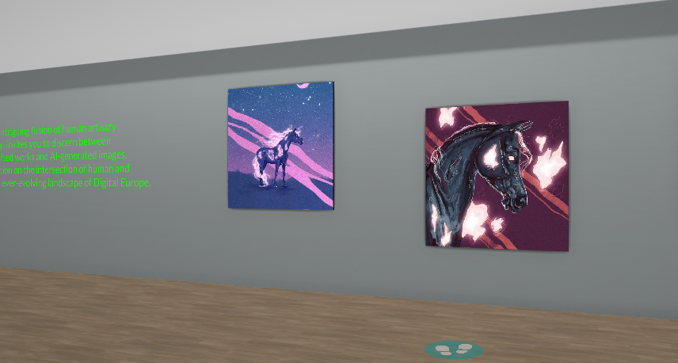

# Pixelpeople

by Sara Vandasova, Ege Akpinar, Felix Fischer, Tizian Wenzel at Driebergen-Rijsenburg Summer School 2023

# Image generation

## Fine-tuning stable diffusion

### Imitating styles of unknown artists

Our working group concerned itself with the AI generation of images. In particular, we explored fine-tuning stable diffusion in order to generate art in the style of unknown artists.

In order to achieve this, we used dreambooth: First, we installed the required libraries on the server used for training and cloned the dreambooth git repository. Second, we selected images of our target style, for example sketches provided by Johannes. We then associated these images with a token, that is a (preferably) unique identifier for the style, in this case “Johannes style”.
Next, we finetune stable diffusion be training the original model for 400 steps on the provided images. We can then use the finetuned model to generate pictures in the unknown artist’s style:





The dataset with "Johannes pictures" contained 31 pictures. We were able to generate sketches with objects (such as the train) that were not in the original dataset.

Furthermore, we finetuned stable diffusion on 4 horse pictures of Celina. As this training data shows significantly less variance and is smaller, we were only able to generate horses in her style:

* Original





With this limited dataset, the model often produced very similar (almost copied images) of the subject with a slightly different background. As this work is an academic research project, this does not cause any copyright issues. However, the situation would be unclear for commercial use.

Using the same technique, we copied the styles of two Dutch painters, Karel Appel and Pieter Bruegel. We tried to generate images representing our summerschool in their artstyle. Whilst the elements of digitalisation are not really visible, the finetuned model manages to capture the style of these two artists:





Overall, we managed to imitate the style of various artists previously unknown to stable diffusion by finetuning it using dreambooth.

### Including real people

Furthermore, we finetuned the model with images of ourselves. With the resulting model we could generate paintings of ourselves or modify our bodies. Generating non-realistic images worked best, as stable diffusion really struggles with generating photo-realistic faces.





Originally, we planned to finetune the model on multiple people and tranfer them to other places, e.g. the google headquarters or "mix" multiple people, trying to generate an "average participant". However, we didn't manage to produce the expected results.

In summary, we had concrete goals (e.g. imitating an artist's style) as well as clear instructions on dreambooths website. However, the process of finetuning and generating the images wasn't straigth forward but rather experimental, as we needed to gain a lot of experience in selection suitable training images, prompts and hyperparameters first. Furthermore, often unexpted results are produced or procedures don't work without us knowing why.

## Using web interfaces

We also used publicly available online tools like https://clipdrop.co/stable-diffusion and https://playgroundai.com/ to generate images in the style of known artists. Of course this method doesn't work for unknown artists like Celina and Johannes. However, it was able to imitate the style of e.g. Rembrandt and Hieronymus Bosch and fuse it with our digital academy:



In our experience, playground AI had more settings, which allowed more custizability. However it also made generating huge amounts of images easier. Both webinterfaces were easy to use and produced great results without the hassels of setting up and finetuning stable diffusion locally.

## Virtual Art Exhibition

Finally, we used https://www.artsteps.com/ to exhibit our generated pieces. On this webservice, one is able to build a virtual museum in which you can walk freely. Textual descriptions can be attached to the images. We used ChatGPT to generate these and titles of some of the artworks. The descriptions are also be supplemented by audio. We used https://ttsmaker.com/ to convert the text to realistic voices. Furthermore, one can create a guided tour which leads you through the virtual museum.

The exhibition can be viewed on a screen and controlled by walking around in the virtual museum. In addition, an App is available. This App can be used in combination with Cardboard VR goggles to view the exhibition in 3D VR. Sadly, the App is not compatible with "dedicated" VR headsets like the Meta Quest.

Our exhibition features the artworks in the styles of various Dutch artists, Abs pictures of us as well as paintings of us. In addition, two "guess the AI generated pictures" exhibitions feature show and generated artworks from Celina and Johannes:



We therefore present the results in a virtual gallery which nicely encompasses our creative process. Sadly, we are not able to view it in VR. As we want to preserve our results in case of the website shutting down, we record the guided tour on video.

## Technical Details

In this section, we discuss the technical details of the finetuning of stable diffusion. With the following script, one can finetune stable diffusion (the model `MODEL_NAME`) with the images in `INSTANCE_DIR`. The prompt associated to these images is `--instance-promt` and should be a unique identifier. We use the hyperparameters from https://huggingface.co/docs/diffusers/training/dreambooth

```
export MODEL_NAME="CompVis/stable-diffusion-v1-4"
export INSTANCE_DIR="./data/people_felix"
export OUTPUT_DIR="./finetune/people_felix"


accelerate launch ../diffusers/examples/dreambooth/train_dreambooth.py \
  --pretrained_model_name_or_path=$MODEL_NAME  \
  --instance_data_dir=$INSTANCE_DIR \
  --output_dir=$OUTPUT_DIR \
  --instance_prompt="a photo of a felix person" \
  --resolution=512 \
  --train_batch_size=1 \
  --gradient_accumulation_steps=1 \
  --learning_rate=5e-6 \
  --lr_scheduler="constant" \
  --lr_warmup_steps=0 \
  --max_train_steps=400 
```

The resulting model is stored in `OUTPUT_DIR`.
We generate images as follows:

```
import torch
from diffusers import DiffusionPipeline

pipe = DiffusionPipeline.from_pretrained(model_id, torch_dtype=torch.float16).to("cuda")
image = pipe(prompt, num_inference_steps=50, guidance_scale=7.5).images[0]

image.save("output.png")
```

with `model_id` the path to the previously saved model and `prompt` the image prompt.

### Prior preserving and finetuning the textencoders and the UNet

When finetuning on e.g. pictures of a "sks dog", the network can forget all other dogs. This can be avoided by feeding it other pictures of dogs while finetuning. This is called prior preservation. We managed to avoid the network "forgetting" all other dogs using prior preservation, however for other types of pictures (e.g. of us), the pictures of ourselves were also worse.

`--train_text_encoder` is supposed to improve faces by also training the text encoder. However, we couldn't reproduce these results.

Therefore, we didn't use neither prior preserving nor UNet training for our final results.

### Trivia

During our experiments, we generated a total of over 2400 pictures. The finetuned models need a total disk space of 353 GB. This poses serious sustainability questions concerning our art.
